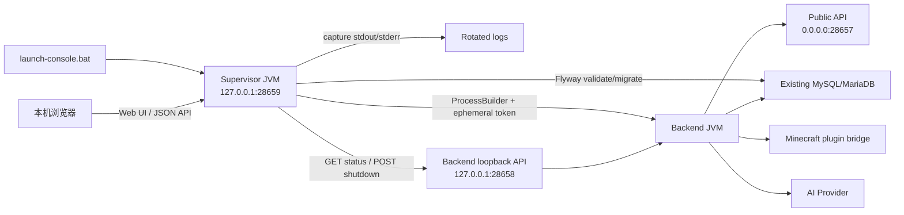
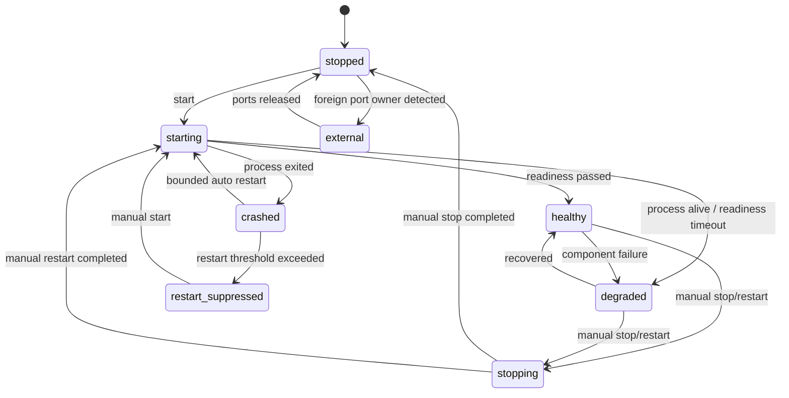
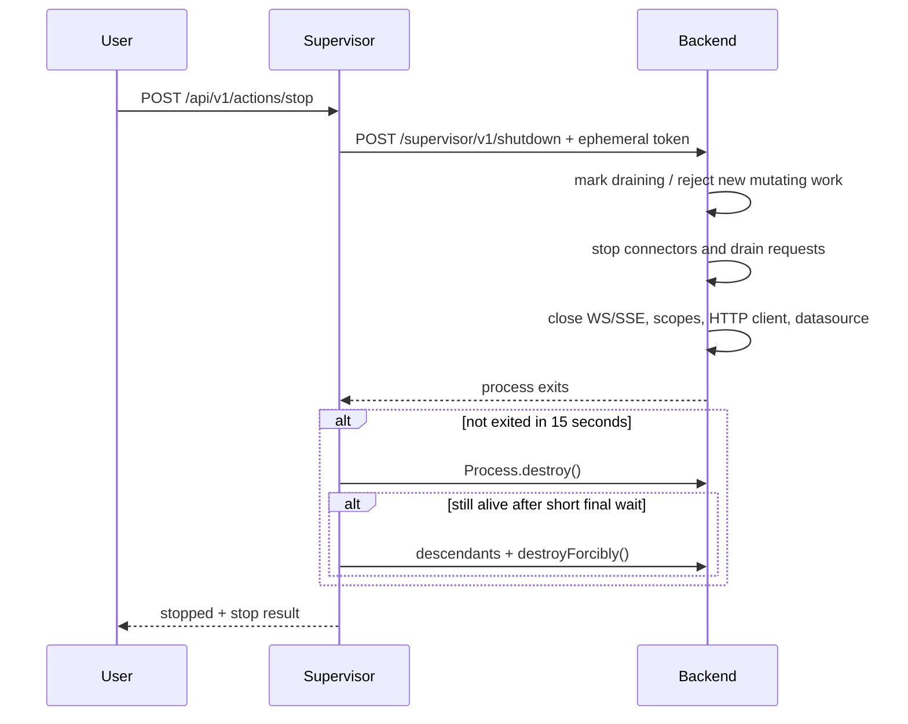

# ADR 0007: Windows 本地 Web 后端启动台

## 状态

Accepted

## 日期

2026-07-15

## 背景

DeuteriumAPP 后端当前通过 `start-backend.bat` 在 Windows 控制台中前台运行。脚本能够选择随包 JRE、检查配置和关键 JAR，但不提供进程所有权、日志持久化、组件状态、诊断包、优雅停止或受限自动恢复。

当前 App 依赖公网 `28657` 上的 REST、聊天 WebSocket 和 AI SSE；Minecraft 插件、NapCat 和 AI 管理面使用 loopback `28658`。启动台必须改善本机运维，但不得修改当前 App 的公网路径、鉴权、消息或错误语义，也不得误杀用户手动启动的 Java 进程。

用户在 2026-07-15 进一步确认最终运维形态：交付一个已经包含 JRE、后端、启动台、迁移资源和当前生产配置的完整文件夹；复制到服务器后只双击 `launch-console.bat`，自动连接现有数据库并完成兼容迁移和启动，不再要求安装依赖、编辑配置、设置环境变量或手工执行脚本。私有环境继续使用当前明文 HTTP/WS，属于明确接受的部署取舍。

本 ADR 延续 ADR 0005 的“旧 App/旧 API 兼容、桥回复优先”约束，以及 ADR 0006 的 AI SSE 和 28658 本地桥边界。

## 决策

新增一个独立 Kotlin/JVM supervisor。`launch-console.bat` 只使用随包 JRE 启动 supervisor；supervisor 在 `127.0.0.1:28659` 开始提供本地 Web UI 和 JSON API 后立即打开页面，并在后台自动执行制品预检、数据库兼容迁移和后端启动。正常路径不向用户提问，也不需要首次配置向导。

第一版只做：

- 观察后端及其依赖状态；
- 在启动前校验固定生产配置、制品 hash 和目录权限；
- 自动执行后端随包 Flyway `validate`/`migrate`，迁移成功后再启动业务端口；
- 启动、优雅停止和重启 supervisor 自己创建的后端子进程；
- 捕获、轮转和查询子进程日志；
- 在本机生成脱敏诊断包；
- 对异常退出执行有限、可熔断的自动重启。

第一版明确不做：

- 配置编辑；
- 用户手工选择 migration、数据库重置、repair/clean、备份或恢复；
- Minecraft、NapCat、PassNAT 或其他任意进程的启停；
- 任意命令、shell、脚本或 JVM 参数执行；
- 公网管理、远程登录、多用户权限或云控制面；
- 代替 Windows Service Manager 的通用服务管理。

## 架构



supervisor 使用 JDK `jdk.httpserver` 的 `HttpServer` 和内嵌静态 HTML/CSS/JS，不引入 Node、Python、PowerShell Web 服务、浏览器扩展或公网 CDN。JDK 17 官方 API 已提供本地 HTTP server；进程启动和所有权使用 `ProcessBuilder`、`Process`、`ProcessHandle`。

参考：[JDK 17 HttpServer](https://docs.oracle.com/en/java/javase/17/docs/api/jdk.httpserver/com/sun/net/httpserver/HttpServer.html)、[JDK 17 Process API](https://docs.oracle.com/en/java/javase/17/core/process-api1.html)。

## 零配置便携交付

交付目录是唯一运行边界，所有路径都从 `launch-console.bat` 所在目录解析，不依赖当前工作目录、盘符、注册表、用户级环境变量或固定绝对路径。完整文件夹可移动到包含空格和非 ASCII 字符的路径。

专用生产包必须包含：

- 已验证的 Windows x64 JRE 17；
- supervisor 和 backend 的全部 JAR；
- 当前生产 `application.conf`，包括数据库、pepper 和 bridge token；
- 只增量执行的 Flyway migration；
- 静态 Web 页面、hash manifest、版本文件和简短使用说明。

双击后的固定顺序：

1. 使用 `%~dp0` 定位包根目录并启动随包 supervisor；
2. 校验 manifest、JRE、固定配置、日志目录和 28657/28658/28659；
3. 若发现 28657/28658 已由外部后端占用，则进入 `external`，只打开只读页面，不执行迁移或启动第二实例；
4. 对现有数据库执行 Flyway `validate`；校验成功后只执行随包、checksum 固定的 `migrate`；
5. 迁移成功后启动后端，等待 internal/public health；
6. 打开本地启动台；状态达到 `healthy` 或 `degraded` 后即可由当前 App 使用。

自动迁移只允许 expand-compatible SQL。失败时保留 `starting` 并以 `startupPhase=migration_failed` 显示原因，然后停止本次启动；不得自动执行 `repair`、`clean`、回滚、建库、恢复或重置。配置缺失、JRE 缺失或 manifest 不一致均视为交付包损坏，给出明确错误，不要求用户现场补配置。

明文 HTTP/WS 和生产配置随包是本专用私有部署的已接受风险。仍然禁止把配置值写入启动参数、页面、普通日志或诊断包，因为这些回显对“双击即用”没有任何帮助。

## 进程所有权

### 自己启动的进程

supervisor 通过参数数组调用 `ProcessBuilder`，不拼 shell command：

```text
backend/jre/bin/java.exe
<validated fixed JVM options>
-classpath
backend/lib/*
com.deuterium.backend.ApplicationKt
```

它保存：

- `Process`/`ProcessHandle`；
- PID、启动时间和 supervisor 生成的 launch id；
- 后端主 JAR SHA-256；
- 本次临时 supervisor token；
- 最近 exit code 和退出时间。

只有当前 supervisor 实例通过 `ProcessBuilder` 创建、且 `ProcessHandle` 的 PID/启动时间仍匹配的进程，才允许 stop/restart。不能只凭端口或 Java 命令行判断所有权。

### 外部进程

如果 28657 或 28658 已被占用，但 supervisor 没有对应 `Process`：

- 状态进入 `external`；
- 只执行公开 health 和允许的 loopback 只读探测；
- 禁用 stop、restart 和自动恢复；
- 不调用 `taskkill`，不扫描并杀死 java.exe；
- UI 明确提示“该进程不是本启动台启动的”。

外部进程退出且端口释放后，状态回到 `stopped`，由用户显式点击 start。

## 状态模型

固定状态：

| 状态 | 含义 | 可用操作 |
| --- | --- | --- |
| `stopped` | 没有受管进程，端口未被外部占用 | start |
| `starting` | 正在预检、迁移、创建子进程或等待 internal/public readiness | stop |
| `healthy` | 进程存活，关键组件通过 | stop、restart、diagnostics |
| `degraded` | 进程存活，但 DB/桥/API/队列等至少一项异常 | stop、restart、diagnostics |
| `stopping` | 已进入 drain/stop 流程 | diagnostics |
| `crashed` | 非人工停止且进程异常退出 | start、diagnostics；可能自动重启 |
| `restart_suppressed` | 10 分钟内自动重启超过阈值，熔断 | 人工 start、diagnostics |
| `external` | 端口被非受管进程占用 | diagnostics，只读 |

状态转换由 supervisor 单线程 state reducer 串行执行，HTTP handler 不直接修改进程状态。

`starting` 内使用非顶层字段 `startupPhase` 细分 `preflight`、`migration_validate`、`migration_apply`、`backend_start`、`health_wait` 和 `migration_failed`；不新增会破坏既定状态机的公开状态。迁移尚未成功时不会监听公网业务端口。



## 自动恢复

- 仅对“supervisor 自己启动的后端发生非零/异常退出”自动恢复。
- 退避为 2 秒、10 秒、30 秒；之后仍使用 30 秒，但受 10 分钟窗口限制。
- 10 分钟内完成 3 次自动重启后再次异常退出，进入 `restart_suppressed`。
- 人工 stop 永不自动拉起。
- 人工 restart 只执行一次，不计入自动重启次数，但若新进程随即异常退出，后续退出计入窗口。
- 配置缺失、JRE 缺失、manifest/迁移校验失败、日志目录不可写、端口冲突属于确定性启动错误，不自动重试，也不弹出配置向导。
- DB 或插件离线但 JVM 仍存活时进入 `degraded`，第一版不因组件退化自动重启。重启不能修复外部依赖，避免抖动。

## 后端 loopback 管理面

后端在现有 `bridge.host=127.0.0.1`、`bridge.port=28658` 上新增：

- `GET /supervisor/v1/status`
- `POST /supervisor/v1/shutdown`

不得把这两个路径注册到公网 `28657`。

### 鉴权

supervisor 每次启动生成至少 256-bit 随机 token，通过子进程环境变量传递，不出现在命令行、配置文件或日志中。请求使用：

```http
X-Deuterium-Supervisor-Token: <ephemeral-token>
```

后端做 constant-time compare。没有 token、token 错误、非 loopback remote address、Host 不匹配均返回 404 或 403，且日志不得记录 token。

同一 Windows 用户下的恶意进程可能读取环境、调用 loopback 或注入本机流量，这是明确接受的残余风险。启动台不是同机恶意代码的安全边界。

### 状态内容

internal status 只返回聚合运行数据：

- build/version/JAR hash、PID、JVM uptime、draining；
- public/bridge connector 状态；
- REST in-flight、App WS 连接、plugin/OneBot 连接、active AI streams；
- Hikari active/idle/pending/max 和 acquire latency；
- plugin event queue depth、oldest age、reject/replay；
- DB、plugin、public API 的 component state 和最近一次成功时间；
- 最近有限条、已脱敏错误摘要。

不得返回 JDBC URL、用户名、密码、token、pepper、AI key、请求 body、聊天内容或玩家隐私数据。

## 优雅停止



实现要求：

- runtime 由单一 owner 管理两个 Ktor engine、maintenance、bridge scope、AI client 和 datasource；
- stop 幂等；重复 stop 返回当前 stopping/stopped 状态；
- 先进入 draining，再停止接受新请求；
- 钱包/购买等已进入事务的操作必须完成或回滚，不能靠中断线程终止；
- 最长优雅等待 15 秒，之后才允许 `destroy()`；
- `destroyForcibly()` 是最后手段，并记录原因；
- 使用 Ktor engine 的 grace/timeout 能力，而不是把公网 shutdown URL 暴露出来。Ktor 官方提供 shutdown/grace 配置参考：[Creating and configuring a server](https://ktor.io/docs/server-create-and-configure.html)。

## 启动台 HTTP 安全模型

supervisor 无用户登录，但必须同时满足：

1. socket 只绑定 IPv4 `127.0.0.1:28659`，不绑定 `0.0.0.0`；
2. 每次请求再次校验 remote address 为 loopback；
3. `Host` 只接受 `127.0.0.1:28659`；
4. mutation 只接受 `POST`、`Content-Type: application/json`；
5. mutation 必须带 `X-Deuterium-Console: 1`；
6. 浏览器请求的 `Origin` 必须等于 `http://127.0.0.1:28659`；
7. 不发送任何 `Access-Control-Allow-*`，不响应跨站 preflight；
8. `Cache-Control: no-store`、`X-Content-Type-Options: nosniff`、严格 CSP；
9. 静态资源使用内嵌固定映射，不把 URL path 拼到文件系统；
10. API 不接受 command、path、JVM options、config key 或任意环境变量参数。

自定义 header + JSON content type + 禁用 CORS 用于阻止普通跨站 form/JavaScript 调用。它不防同机恶意进程，残余风险同上。

## 本地 API

### `GET /api/v1/status`

返回 supervisor state、owned/external、PID、uptime、资源摘要、component status、最近重启和可用 actions。数据模型包含 `schemaVersion=1`，后续只做 additive 演进。

### `GET /api/v1/logs?cursor=&limit=`

- cursor 为 opaque、带校验的单向游标，不接受文件路径；
- `limit` 默认 200，最大 1,000；
- 返回结构化时间、stream、level（可解析时）和 message；
- message 在写盘和返回前执行敏感键脱敏。

### `POST /api/v1/actions/start`

- body 固定 `{}`；
- 只在 `stopped` 或 `restart_suppressed` 允许；
- 与首次双击自动启动复用同一条 `preflight -> validate/migrate -> backend start -> health wait` 流程；
- 缺配置/JRE/目录权限/端口冲突或迁移失败返回确定的本地错误码；
- 不接受任何启动参数。

### `POST /api/v1/actions/stop`

- body 固定 `{}`；
- 只控制 owned process；
- 返回 action id，UI 轮询 status。

### `POST /api/v1/actions/restart`

- body 固定 `{}`；
- 等价于一次有状态的 graceful stop + start；
- 不允许并发叠加 start/stop/restart。

### `POST /api/v1/diagnostics`

- body 仅允许固定枚举，例如 `{"includeThreadDump":true}`；
- 生成 ZIP 到受控 `diagnostics/` 目录；
- 返回文件名和 SHA-256，不接受目标路径；
- external 状态默认不抓 thread dump，除非能证明目标是 owned process。

## UI 范围

第一版单页展示：

- 总状态、PID、启动时间、uptime、exit code；
- `startupPhase`、迁移版本、是否需要迁移及最后一次迁移结果；
- CPU、RSS、线程、句柄（Windows 可取得时）；
- 28657/28658 端口和 public health；
- DB/Hikari、plugin bridge、OneBot、App WS、active AI streams；
- plugin event queue 和最近错误；
- 最近自动/人工重启；
- 可筛选实时日志；
- start/stop/restart/diagnostics 按钮及确认。

UI 不提供配置 textarea、文件浏览器、SQL、终端或任意命令输入。

## 日志

- supervisor 同时读取 stdout/stderr，避免子进程 pipe 填满后阻塞；
- 日志文件单个 32 MiB 后轮转；
- 最长保留 14 天；
- 全部 backend/supervisor 日志总量不超过 256 MiB；
- 达到总量先删最旧、已关闭的轮转文件；
- 当前写入文件不删除；
- supervisor 自身事件使用独立结构化日志；
- `password`、`token`、`secret`、`pepper`、`key` 等键及 Authorization/cookie/JDBC userinfo 在写盘前脱敏；
- 日志目录不可写时启动失败，不退化为吞日志后继续运行。

## 诊断包

诊断包可包含：

- supervisor/backend 版本、hash 和状态快照；
- 最近受控大小的日志；
- 端口/TCP 摘要；
- owned JVM 的 thread dump、heap summary、GC/class histogram（可取得时）；
- Hikari/队列/WS/SSE 聚合指标；
- 配置 key 列表和每项来源，但不含值；
- 重启时间线。

不得包含：

- 原始 `application.conf`；
- 环境变量全集或命令行中的敏感值；
- 数据库业务行；
- AI prompt、聊天正文、玩家 QQ、token 或 cookie；
- heap dump。第一版 heap dump 泄露风险和体积过高，不提供。

脱敏后再压缩，并对最终 ZIP 再执行一次敏感模式扫描。失败即删除未完成包并返回错误。

## 兼容性

- 28657 上现有 REST/WS/SSE 不变。
- 28658 只新增 `/supervisor/v1/*`，不修改现有 plugin/OneBot/admin path。
- 当前 App 不知道也不调用 supervisor。
- internal status 不能通过调用业务写接口实现探测。
- 正式启用 supervisor 前，旧 `start-backend.bat` 仍可作为手动只读兼容入口，但 supervisor 对其启动的进程进入 `external`，绝不接管。
- 数据库迁移必须 expand-only，使旧后端二进制仍可回滚运行。
- 当前专用生产包保留既有 `application.conf`，启动台不得要求用户再次录入同一配置。
- 当前 App 的明文 HTTP/WS 地址保持不变；TLS 和证书不是本 ADR 的启动前置条件。

## 失败处理

| 场景 | 决策 |
| --- | --- |
| 配置缺失 | 视为包损坏；`stopped`，显示应重新复制完整包，不要求现场编辑 |
| 随包 JRE 缺失 | 视为包损坏并失败；不回退系统 Java，保证复制后的运行时确定性 |
| migration validate/migrate 失败 | 不启动公网端口，不 repair/clean/reset；显示失败版本和已脱敏原因 |
| 28659 冲突 | supervisor 自身启动失败并输出占用信息 |
| 28657/28658 冲突 | `external`，禁止控制 |
| 首次启动时 DB 离线 | 停在 `starting/migration_failed`；保留页面供重试，不启动业务后端 |
| 运行期间 DB 离线 | backend `degraded`；不自动重启 JVM |
| plugin 离线 | backend `degraded`；REST 中不依赖桥的功能继续 |
| 子进程崩溃 | 按 2/10/30 秒退避，超过阈值熔断 |
| graceful shutdown 超时 | 记录并逐级 destroy/force；生成诊断建议 |
| 重复 start | 幂等拒绝，不创建第二个子进程 |
| 日志目录不可写 | 启动前失败 |

## 被否决方案

### BAT 菜单 + `tasklist/taskkill`

无法提供可靠所有权、结构化状态、日志游标和安全 Web UI，且容易误杀外部 Java 进程。

### PowerShell/Python/Node 本地服务

引入额外运行时、执行策略或包管理依赖，不符合随包 JRE 即可运行的交付目标。

### 把管理 API 放在 28657

扩大公网攻击面，也可能被隧道暴露；拒绝。

### 自动重启所有 degraded 状态

DB、插件或隧道故障通常不能通过重启后端修复，反而制造重连风暴；拒绝。

### 接管任意占端口进程

无法证明所有权，存在误杀和数据损坏风险；拒绝。

## 后果

正面后果：

- 后端有明确进程 owner、有限恢复和优雅停止；
- 事故证据可保存并脱敏导出；
- 运维无需 Node/Python/PowerShell Web 服务；
- 完整文件夹复制后可通过一次双击自动完成预检、兼容迁移和启动；
- 当前 App 协议完全隔离。

代价：

- 交付包新增一个 Kotlin/JVM 模块和本地端口；
- 专用生产包携带实际配置，必须按用户认可的私有制品范围保存；
- 后端需要小型 loopback status/shutdown 接口和统一 runtime lifecycle；
- supervisor 自身也必须测试状态竞态、日志轮转和本机 Web 安全；
- loopback 无登录不抵御同机同用户恶意进程，这是接受的残余风险。

## 验收

实现必须覆盖：完整目录复制后双击自动启动、含空格/非 ASCII 路径、首次无需输入、无系统 Java、无需 Node/Python、无需环境变量、无需手工 migration；同时覆盖缺配置、缺 JRE、manifest/迁移 checksum 异常、28657/28658/28659 端口冲突、DB 离线、plugin 离线、子进程崩溃、优雅退出超时、重复启动、日志目录不可写、外部进程和重启熔断。

安全测试必须覆盖：非 loopback、伪造 Host/Origin、跨站 form、CORS preflight、路径穿越、参数/命令注入、日志和诊断包敏感信息泄露。

兼容测试必须使用 `DeuteriumAPP-1.0.4-ai-sse-20260616.apk` 的冻结契约；任何现有 REST/WS/SSE 破坏均阻断发布。

## 实施记录（2026-07-15）

ADR 的第一版已在 `codex/backend-hardening-console` 落地。supervisor 和 backend 以同一组只读 JAR 依赖交付，但由两个独立 JVM 进程和两个不同 main class 运行；Web 静态资源内嵌在候选 JAR，未增加 Node/Python/公网资源。便携包实际结构将 supervisor main 与 backend main 共置于 `backend/lib`，省去重复依赖目录，不改变本 ADR 的进程所有权或端口边界。

自动迁移入口只连接既有数据库，不执行 `CREATE DATABASE`、repair、clean 或 reset；业务主入口保留原手工启动兼容行为。候选包没有新增或修改 Flyway SQL，因此对已运行 1.0.4 的数据库只会做 checksum/历史校验和幂等 migrate。

自动化验证已覆盖 loopback 绑定、伪造 Host、跨站表单、缺少自定义请求头、无 CORS、CSP、诊断脱敏和重复状态操作；黑盒验证覆盖随包 JRE 的 `jdk.httpserver`、含中文/空格路径、静态页面、状态与诊断 API。DB 离线、真实子进程崩溃/熔断、优雅退出超时和生产插件离线仍需在隔离的完整运行环境验收。
