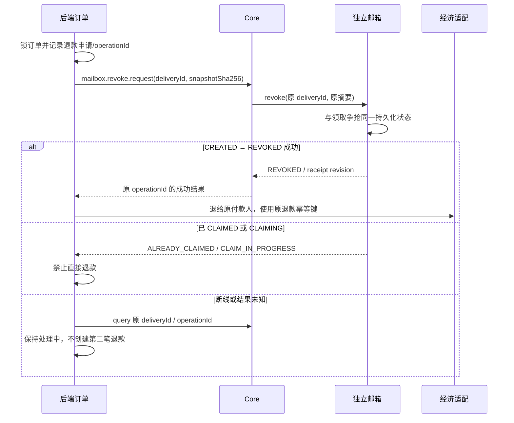

# 独立邮箱需要提供的 API 与调用时序

日期：2026-09-08。**用户已明确：Deuterium-Mail 保持独立插件，Core 不包含邮箱。用户将根据本文修改邮箱；本任务没有修改邮箱源码。** 本文是待实施对接契约，不代表现有 MailService 已支持。

## 1. 分工与现有缺口

| 组件 | 权威职责 |
| --- | --- |
| Linux 后端 | 账号、商品／订单、付款编排、退款、投递记录、通知和审计 |
| Deuterium Core | Linux 远程长连接、受控命令、物品库版本解析、调用邮箱 API、持久化事件转发 |
| 独立 Deuterium-Mail | 共享邮件与附件、收件归属、已读／删除、领取范围、领取／撤回互斥、背包副作用和异常记录 |
| YouerModSync 及适配 | 玩家数据成功加载、当前会话代次、领取与保存／切服协调 |

当前本机邮箱 `ExternalMailRequest` 已有 source、deliveryKey、recipientUuid、title/body、creditAmount 和 `List<ItemStack>`。这可作为兼容入口；但当前结构没有每封邮件的可领取服务器范围、模板版本与内容摘要。`MailService.deliverExternalMail()` 的接口存在不能据此认定跨服 query/revoke/claim 通知和不确定结果保护已经满足本契约。

建议新增版本化 API，保留旧入口的既有语义。Core 通过服务注册发现该 API；没有邮箱、API 版本不符或能力未就绪时停止此业务，不改为执行 `/give` 或直接写邮箱表。

## 2. 能力查询：先判断能不能安全卖

`capabilities()` 返回：

```json
{
  "apiVersion":1,"clusterId":"deuterium-production","storageReady":true,
  "idempotentDelivery":true,"queryByDeliveryId":true,
  "atomicClaimRevoke":true,"sharedMailbox":true,
  "perMailClaimScope":true,"uncertainClaimProtection":true,
  "durableEvents":true
}
```

这些必须来自真实实现与健康状态，不是 Core 替邮箱填 true。官方商店付费交付需要全部关键项可用；read-only 邮箱仍可独立工作。clusterId 不同的测试实例不可接收生产订单。

## 3. 创建订单邮件

后端在付款权威成功后持久化 deliveryId、orderId 和不可变内容；Core 收到 `mailbox.create.request` 才调用邮箱。

请求必须包含：

| 字段 | 规则 |
| --- | --- |
| operationId | 本次创建操作的稳定 ID；传输重试不能更换 |
| deliveryId | 该笔实际交付的稳定 ID，邮箱按 source+deliveryId 全网唯一 |
| orderId | 订单引用，便于查询与审计，不用于替换 deliveryId |
| recipientUuid | 从已认证买家绑定取得，客户端不填写 |
| source | 固定受控来源 `deuterium-commerce` |
| title/body/sender | 冻结的邮件文本，有长度上限，纯文本或邮箱明确定义的安全格式 |
| snapshotJson | 后端冻结的 UTF-8 JSON 原文，含 schemaVersion、orderId、recipientUuid、模板 revision、附件引用/数量/摘要、明确 serverId 白名单 |
| snapshotSha256 | 对 snapshotJson **原始 UTF-8 字节**计算 SHA-256；接收端不能重排 JSON 再比较 |
| resolvedAttachments | Core 按快照引用从物品库读取并验证的附件；具体 Bukkit/NeoForge 类型通过邮箱平台 API 传递 |
| allowedServerIds | 与 snapshotJson 中一致，非空已知 serverId 名单；不传星号或动态预设 |
| inventoryDomain | 与商品发货策略一致；用于防止在不共享的背包域领取 |

信用点商品付款与“邮件内附赠信用点”分开。商城实物交付默认 creditAmount=0；不得把订单扣款再写成一笔邮件信用点奖励。

Core 必须逐项核对 `itemRef + revision + payloadSha256 + quantity`。附件总数、最终数量与编码大小超过限额时拒绝整笔投递；禁止静默截断、跳过缺失模板、自动使用最新版或降级成普通原版物品。

邮箱创建事务一次写邮件、附件不可变快照、收件人、允许领取名单、source+deliveryId 幂等映射和出站事件。事务失败不留下空邮件。已存在同一 deliveryId：内容完全一致返回原 receipt；内容不同返回 DELIVERY_CONFLICT，不覆盖已有邮件。

返回：

```json
{
  "deliveryId":"delivery_opaque","mailId":"mail_opaque",
  "status":"CREATED","snapshotSha256":"<64 hex>",
  "recipientUuid":"<bound UUID>","allowedServerIds":["amiya","odyssey"],
  "revision":1,"replayed":false
}
```

网络超时不等于投递失败。后端先 query 原 deliveryId；只有邮箱保证同键同内容幂等时才允许重投原请求。任何人都不能点“重试”创建一个新的 deliveryId 绕过去重。

## 4. 查询必须区分找不到和查不了

`query(source, deliveryId)` 返回同一 receipt 与权威状态：

| 状态 | 含义与后端动作 |
| --- | --- |
| NOT_FOUND | 邮箱存储已成功查询且确实没有此 deliveryId；不是超时默认值 |
| CREATED | 已入共享邮箱，尚未进入领取过程 |
| CLAIMING | 已进入不可与撤回并行的领取阶段；不得退款 |
| CLAIMED | 已完成领取且保存结果有依据；订单不能退款 |
| REVOKED | 附件已不可再领取；后端可以继续原退款操作 |
| FAILED | 有证据证明创建／发放没有产生副作用，附结构化错误 |
| UNKNOWN | 已有或可能已有副作用，但结果不可确定；冻结自动退款与自动重发，人工／程序对账 |

查询失败返回服务错误，不返回 NOT_FOUND。响应 recipientUuid、snapshotSha256、orderId 必须与后端记录一致，否则按异常处理，不能仅看一个 status 字符串。

## 5. 未领退款：撤回必须先于退款



`revoke` 字段：operationId、source、deliveryId、orderId、expectedSnapshotSha256、reasonCode。响应要区分 REVOKED、ALREADY_REVOKED、ALREADY_CLAIMED、CLAIM_IN_PROGRESS、UNKNOWN、NOT_FOUND。重复撤回 REVOKED 应返回原结果，不重置已领状态。NOT_FOUND 是否允许取消未发送交付由后端投递状态和 outbox 共同确认，不能直接当成“邮件未领”。

建议数据库层用同一行条件更新／行锁保护 CREATED→CLAIMING 与 CREATED→REVOKED。不得先把物品发入背包，再尝试抢领取锁。撤回不能删除玩家已领取的背包物品以伪造成功。

## 6. 领取、切服和缺模组

每个领取入口统一检查：

1. 当前玩家 UUID 等于收件人；账号显示名不能决定归属。
2. 当前节点本服领取总开关允许。
3. 当前节点在邮件冻结的 allowedServerIds 内，并属于正确 inventoryDomain。
4. 当前服务端与客户端支持所需物品组件，包括容器里的嵌套物品。
5. 玩家仍在本服同一个登录／切服代次，数据同步**已成功加载**，不是仅“同步中标记消失”。
6. 整封附件预检背包容量，不先展开百万个 ItemStack 再判断。
7. 在共享存储持久化领取执行身份并与撤回互斥；持有保存／切服屏障后执行。
8. 实际背包写入与保存确认成功后记 CLAIMED；部分失败或确认丢失记 UNKNOWN，保留已发生副作用证据，不能释放锁后重新整封发。

Login 默认禁领，包含信用点。Amiya/Odyssey 按已确认策略允许但仍受上述条件限制；MEK 默认禁领，待兼容/背包域/屏障实测后调整。

禁止领取的子服仍能查看正文、安全物品元数据和未领状态；不能为显示图标反序列化该服缺少的模组附件。空范围不等于全部服务器；新增服务器不自动获得旧邮件领取权限。

## 7. 邮箱事件：要能断线补发

邮箱自己的事务 outbox 保存 `mailbox.created.event`、`mailbox.claimed.event`、`mailbox.revoked.event` 和 `mailbox.uncertain.event`。事件包含 eventId、deliveryId、orderId、recipientUuid、snapshotSha256、mailRevision、occurredAt；领取事件另含 serverId、claimOperationId、playerSessionEpoch 和可审计的保存结果引用。

Core 订阅／分页拉取邮箱出站事件，持久化转发；只有后端 committed ACK 后才确认消费。不能只给一个内存 listener 然后声称跨重启可靠。全网事件由同一消费者租约或稳定 eventId 去重，不能四个 Core 给同一次领取生成四个新 ID。

后端处理消息先校验收件身份、摘要与允许状态，再按 eventId 和资源 revision 幂等更新。迟到 CREATED 不覆盖 CLAIMED；revoke 与 claimed 冲突不得靠“最后一条事件获胜”，应 query 权威记录并阻止资金动作。

## 8. 用户修改邮箱时的最低验收集

| 场景 | 必须结果 |
| --- | --- |
| 同一 deliveryId 并发 20 次投递 | 同一封邮件、同一附件快照，重复请求返回原结果 |
| 同 deliveryId 改数量、收件人或服务器范围 | 明确冲突，原邮件不变 |
| 两服同一玩家同时领取 | 仅一个获得发放执行权 |
| 领取与撤回并发 | 只能一条状态转换成功；不同时领物又退款 |
| 创建提交后回复丢失 | query／重投找到原邮件 |
| 发出部分物品后抛错／进程退出 | UNKNOWN 保留，不重复整封领取 |
| 保存失败／切服过程中领取 | 拒绝或 UNKNOWN，不宣称保存成功 |
| 数据库离线 | 不回退本地空邮箱发奖，不把查不了变 NOT_FOUND |
| 禁领服查看缺模组附件 | 不反序列化不兼容物品，仍能安全查看正文与元数据 |
| 后端/Core/邮箱重启、事件重复与乱序 | 可补查且不重复改变订单／资金 |

完成这些接口与测试后，再联合 App、网页、后端、Core 和邮箱开放真实商城交付。本文不要求把独立邮箱合并、改名或删除原有非商城功能。
