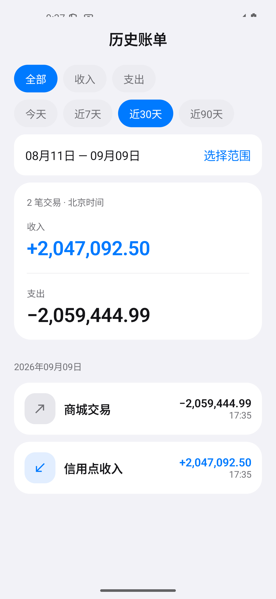
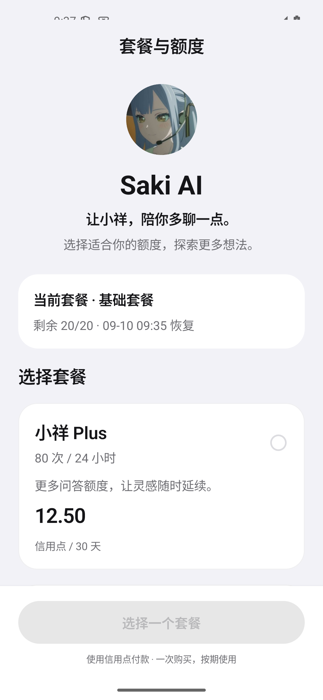
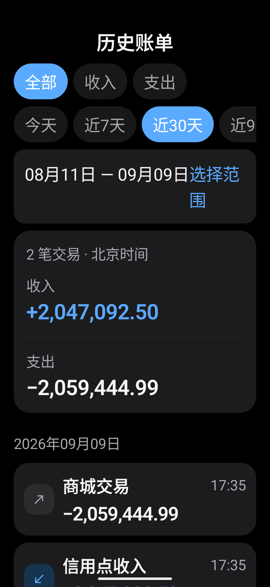
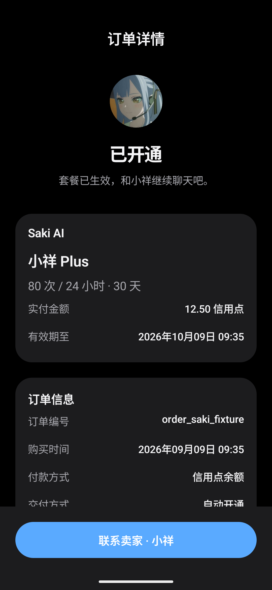
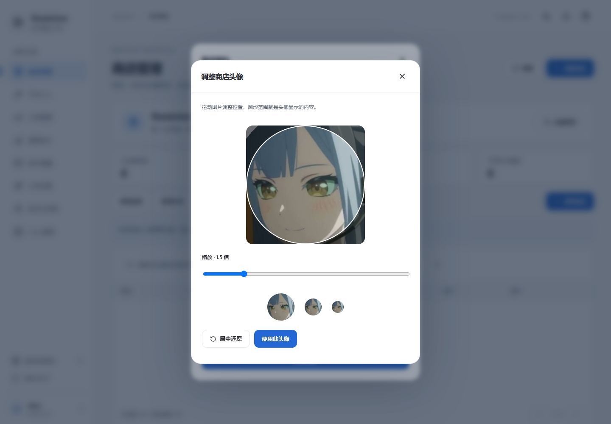

# Saki、账单与后台候选验收

正式 2.0.6 已随后发布，见 [部署记录](../deployment/deuterium-2.0.6-live.md)。以下为候选阶段的历史验收快照。

2026-09-09。本轮实现提交 `6e0b727331a17cad72c622e999b87d08b04e1fca`，分支 `feat/saki-admin-experience`，位于 `C:/DeiteriumAPP-IX/.worktrees/saki-admin-experience`。**已完成本机候选，未推送、合并或部署。线上仍为已有 2.0.5。**

## 本轮结果

- 历史账单按照实际文字宽度切换双列/上下排版，金额不折行；明细在大金额或放大字体时将金额分行。保留完整精度、浅深色和原生分组表面。
- 后台增加小祥设置和账号管理：套餐价格、额度、时间、名称和启用状态；提示词、生成参数、知识条目；用户搜索分页、授予/撤销管理员、封禁/解封及会话撤销。
- Saki 购买进入原有信用点托管与结算，成功后自动开通并停留套餐页。商城订单显示 Saki AI、小祥头像、套餐及有效期，联系卖家进入小祥聊天；无领取、退款按钮，接口同样拒绝主动退款。支持同套餐续期；有效期内跨套餐购买暂不开放，避免覆盖已购权益。
- 创建、编辑商店都可上传头像。圆形预览支持拖动、1–4 倍缩放、键盘移动、还原及 64/40/28 像素预览；输出 512×512 PNG 后保存为店铺头像。已有订单读取当前商家头像。
- 官方商城内部步骤不再逐条发送通知；到货和退款进入站内列表，领取不重复提醒。客户文案去掉执行证明、受益人绑定等术语。App 转账成功回执与收款人通知同事务提交；游戏 /pay 通过已提交流水补取，持久分页和事件去重。
- 网页页头、按钮组和查找表单统一间距与换行，390px 页面没有整页横向溢出。

## 验证证据

| 范围 | 结果 |
| --- | --- |
| Go | 全量 `go test -race -tags integration ./...`：138 项顶层测试通过，包含子用例共 152 项；普通运行跳过显式启用的浏览器夹具。最后的参数兼容调整另行重跑受影响 AI/购买竞态集成测试，通过；`go vet ./...` 通过。 |
| Web | 60 项 Node 测试、Vite 生产构建通过。 |
| Android | 126 项单测通过；assembleDebug、assembleDebugAndroidTest、lintDebug 通过；Lint 0 错误、27 警告。 |
| 原生界面 | 实际模拟器页面：大额收支在浅深色、1.0/1.6 字体下无重叠；取消不付款、确认后只提交一次、支付成功停留套餐页、商城订单及联系小祥通过。 |
| 浏览器 | 隔离 Go/MariaDB 和 React：设置保存、管理员授予和封禁、裁切缩放和店铺头像保存、Saki 确认/购买/订单/联系、移动端宽度和深色页面。页头按钮间距实测 12px。另以实际购买组件验证“确认期间改价”：确认金额保持旧值，旧版本拒绝后按新价重新确认，提交版本依次为 1、2。 |
| 接口 | 4 个实际隔离 HTTP 响应通过更新后的 App OpenAPI 校验：套餐购买、订单详情、成交快照及 AI 权益。见 [响应样本](artifacts/saki206/contracts.json)。 |
| 安装包 | 包名 `com.deuterium.app.uilab`，2.0.5（20500），Android 8.0+；签名 SHA-256 与现行测试版相同。人工覆盖安装成功。本轮保留版本元数据，用于候选验收，尚未写入线上更新清单。 |
| Linux | amd64、CGO_ENABLED=0 构建通过，内嵌源码 `6e0b727`，`vcs.modified=false`。 |

Go 测试只连接本机回环测试 MariaDB，每项使用随机隔离库；浏览器使用短期测试账号与模拟经济/对象存储边界。头像浏览器保存验证曾发现 businessType 错误，修正为 STORE 后通过，并补充新建店铺上传的管理员权限测试。没有执行生产付款、修改生产配置或进行实服领取。模拟器不替代真机手感；AI 参数对真实上游的运行验收留给配套部署阶段。

Android 在 `android-app` 执行的构建命令：

```powershell
./gradlew.bat :ui-lab:assembleDebug :ui-lab:assembleDebugAndroidTest :ui-lab:testDebugUnitTest :ui-lab:lintDebug --offline --console=plain
```

Go 在 `backend-next` 执行 `go test -race -tags integration ./... -json`、`go vet ./...`，Linux 使用 `CGO_ENABLED=0 GOOS=linux GOARCH=amd64` 与 `go build -trimpath -ldflags='-s -w' -o <交付目录>/deuterium-linux-amd64 ./cmd/deuterium`。Web 在 `web-app` 执行 `npm test`、`npm run build`。实际 APK 元数据及校验值在下方交付清单中。

新增配置使用服务端版本检查；不同客户端并发付款仅允许一笔待处理购买。重复请求、关停售卖后的原操作恢复、明确结算失败后的退回、权益到期、不可退款和账号隔离均有测试。自动退回如遇明确失败，保留资金状态并提醒平台处理。通知沿用现有 App 收件箱同步与系统权限，不新增进程被终止后的离线推送通道。

## 原生页面和头像预览

以下为隔离数据的原生页面及浏览器裁切预览。

| 大额账单 | Saki 套餐 |
| --- | --- |
|  |  |

| 放大字体与深色 | Saki 订单 |
| --- | --- |
|  |  |



[小祥后台](artifacts/saki206/ai-admin.png) · [账号后台](artifacts/saki206/accounts.png)

## 本机交付

目录：`C:/DeuteriumAPP/delivery/Deuterium-Saki-candidate-20260909`。包含测试 APK、Web ZIP、Linux Go 程序及 manifest.json。文件大小、SHA-256、签名与源提交见 [交付清单](artifacts/saki206/manifest.json)。没有包含服务器配置、密钥或数据库。

正式发布前需要增加 App/网页发布版本，按 [增量接口和迁移说明](../contracts/saki-admin-v206.md) 备份并执行 021 迁移，再部署 Go/Web、分发新版 App。Saki 售卖须由管理员配置并主动开启，本轮未在线上开启购买。

设计依据：[Apple In-App Purchase](https://developer.apple.com/in-app-purchase/) 的服务、价格和时长说明，以及 [Apple Alerts](https://developer.apple.com/design/human-interface-guidelines/alerts) 的简洁文案与清晰操作；视觉沿用本项目的原生主题与管理工作台。
