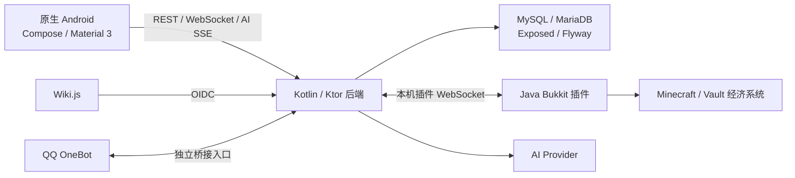

# DeuteriumAPP 完整项目审查

日期：2026-09-07（Asia/Singapore）。本次仅审查，未修改业务代码、提交、发布或操作生产数据库。

## 1. 结论与基线

项目已经具备 Android、后端和 Minecraft 插件的主要业务实现，但账号身份校验、失败限次、会话撤销和资金故障处理存在发布前需要修复的问题。现有测试通过不能证明这些安全边界正确：本次新增的五个隔离复现实验均确认了异常行为。

审查使用的版本关系：

| 对象 | 实际版本与用途 |
| --- | --- |
| GitHub `main` | 本次 `git ls-remote`、fetch 确认为 `bf81890` |
| 三端代码审查目录 | `C:/DeuteriumAPP/.worktrees/readme-consistency`，`816b0d5`；与 `bf81890` 的差异只有 README 删除 71 行，三端源码相同 |
| Android 验证目录 | `C:/DeuteriumAPP/.worktrees/android-client-optimization`；Android 源码与上述基线相同，只有模块 README 不同 |
| Android 主版本 | `1.0.5`，`versionCode=7`；canary 仍为独立 `26063` |
| 后端、插件工程版本 | 均为 `0.1.0`；不能据此识别具体交付包内容 |
| 后端硬化分支 | `codex/backend-hardening-console`，`14ef1b8`；单独比较，未视为已合入公开 main 或已部署生产 |
| 根目录 checkout | `main` 仍停在 `abe6583`，只跟踪九份早期文档；大量源码残留、工具和交付包未跟踪 |

因此，根目录不能直接代表当前公开源码。也不能把本地硬化分支的改进描述成线上已生效。

## 2. 项目全貌



主要模块情况：

| 模块 | 已有实现 | 当前主要缺口 |
| --- | --- | --- |
| account | 注册、游戏验证码、QQ/玩家名登录、密码重设、会话 | 身份比对、失败计数事务、已建立连接的会话撤销 |
| wallet-transfer | 余额缓存、刷新、收款人解析、流水、客户端请求号复用、转账 | 执行结果不确定时的状态处理、插件幂等、成功后的余额更新 |
| chat | 公共聊天、最近历史、在线目录、关注和提及、App/游戏互通 | 会话失效、账号切换缓存、资源上限与故障验收 |
| AI | 流式聊天、额度、付费套餐、知识库、QQ 接入及管理入口 | 扣款持久化边界、订单价格快照、取消后的连接释放 |
| OIDC | Wiki.js 登录、独立 token 和授权码体系 | 登录限次与私钥文件保护仍需补齐 |
| 发布维护 | Gradle 工程、Windows 运行包、公开导出脚本、独立硬化分支 | 公开源码/交付版本统一、正式签名、导出私钥排除、移除生产清库入口 |

已经做对的部分：App 没有直接修改经济数据库；付款身份来自登录账号；玩家绑定以服务器 UUID 为主；密码使用 Argon2；会话 token 在后端以哈希存储；注册与业务字段有基础校验；Android release 使用 HTTPS/WSS 并禁用明文流量；本地聊天落盘按账号分区且有保留上限；存在数据库迁移和部分幂等实现。问题主要集中在异常路径和跨层一致性。

## 3. 按优先级排列的发现

P1 表示应在下一次生产发布前优先修复。P2 表示有明确影响，但通常需要特定故障或操作顺序触发。下面的静态风险没有被描述成已发生的线上事故。

### F01 · P1 · 密码重设未核对验证码接收者 UUID

**证据：** Routes.kt:325（历史引用 `/C:/DeuteriumAPP/.worktrees/readme-consistency/backend-api/src/main/kotlin/com/deuterium/backend/routes/Routes.kt:325`，未纳入当前仓库）。后端按账号保存的旧 `gameId` 投递验证码，只检查 `delivery.status == delivered`，随后把验证记录绑定到原账号 `serverUuid`，没有比较插件实际返回的 `delivery.serverUuid`。

**触发与影响：** 原用户名重新对应其他 UUID、服务器身份规则变化或身份冲突时，当前占用该名称的人可能用自己收到的验证码重设旧账号密码。这违反 ADR 0003 的身份冲突规则。

**验证：** 使用测试桥返回 `different-player-uuid`，验证码仍成功重设了 `server-alice` 对应账号的密码。没有连接真实服务器。

**修复与验收：** 将期望 UUID 纳入投递校验，投递结果必须与已绑定 UUID 一致；不一致时拒绝生成可用重设凭证。覆盖同名不同 UUID、改名和缺失 UUID 三类测试。

### F02 · P1 · 登录和验证码失败计数随错误事务回滚

**证据：** 登录失败路径（历史引用 `/C:/DeuteriumAPP/.worktrees/readme-consistency/backend-api/src/main/kotlin/com/deuterium/backend/routes/Routes.kt:301`，未纳入当前仓库）、验证码失败路径（历史引用 `/C:/DeuteriumAPP/.worktrees/readme-consistency/backend-api/src/main/kotlin/com/deuterium/backend/routes/Routes.kt:1815`，未纳入当前仓库）、事务封装（历史引用 `/C:/DeuteriumAPP/.worktrees/readme-consistency/backend-api/src/main/kotlin/com/deuterium/backend/web/WebSupport.kt:49`，未纳入当前仓库）。先更新计数，紧接着抛异常，外层事务因此回滚。

**触发与影响：** 普通输错密码或验证码就能触发；配置上的次数限制无法形成有效保护。OIDC 登录也在 `dbQuery` 内调用会计数后抛错的 `oidc.login`，有相同结构。

**验证：** 连续六次错误密码全部返回 401，`login_failures` 行数仍为零；连续六次错误验证码后 `attempts=0`，随后输入正确验证码仍可注册。OIDC 此项只做了静态追踪。

**修复与验收：** 将失败结果作为事务返回值，提交失败计数后再映射为 HTTP 错误；同时处理并发消费/计数。验收应经过完整路由，检查失败次数持久化和阈值生效，不能只测试 Repository 的递增 SQL。

### F03 · P1 · 注销、改密或过期不能撤销既有聊天连接

**证据：** Routes.kt:622（历史引用 `/C:/DeuteriumAPP/.worktrees/readme-consistency/backend-api/src/main/kotlin/com/deuterium/backend/routes/Routes.kt:622`，未纳入当前仓库）。聊天 WebSocket 仅建连时认证，随后长期使用捕获的 `currentUser`；注销只修改会话表，Hub 未关联会话撤销。

**触发与影响：** 会话已被撤销或过期，旧 socket 仍可接收消息；发送路径也没有重新验证会话。改密不能可靠切断已建立的旧连接。

**验证：** 注销后 `/account/me` 对旧 token 返回 401，同一个已连接 WebSocket 仍收到 `presence.update`。

**修复与验收：** 连接绑定会话身份，注销/改密主动关闭相关连接，并处理有效期。覆盖“REST 已失效时，旧 socket 必须停止收发”的测试。

### F04 · P1 · 转账已发送后的断线被当作明确失败

**证据：** 桥断线处理（历史引用 `/C:/DeuteriumAPP/.worktrees/readme-consistency/backend-api/src/main/kotlin/com/deuterium/backend/bridge/WebSocketPluginBridge.kt:98`，未纳入当前仓库）、转账异常映射（历史引用 `/C:/DeuteriumAPP/.worktrees/readme-consistency/backend-api/src/main/kotlin/com/deuterium/backend/routes/Routes.kt:463`，未纳入当前仓库）、Android 终态错误集合（历史引用 `/C:/DeuteriumAPP/.worktrees/readme-consistency/android-app/app/src/main/java/com/deuterium/app/repository/AppRepositories.kt:66`，未纳入当前仓库）。桥断线会让已发出的请求收到 `PluginBridgeUnavailable`；路由将转账写为 `failed`；App 清除待确认请求号，允许下次创建新请求。

**触发与影响：** 插件已经接收甚至完成扣款，但回执到达前断线。用户看到失败后重试，可能发生第二笔扣款。插件的 handleTransfer（历史引用 `/C:/DeuteriumAPP/.worktrees/readme-consistency/minecraft-plugin/src/main/java/com/deuterium/plugin/BridgeClient.java:324`，未纳入当前仓库） 也没有使用传入的 `transferId/idempotencyKey` 去重。

**验证：** 测试插件接到转账请求后主动断开、未返回执行结果，后端仍写入 `failed` 并返回 503。实验没有调用真实经济插件，二次扣款后果来自端到端代码路径分析。

**关联缺口：** 超时会写 `unknown`，但重复 POST 和查询接口只返回旧记录；迟到的桥响应找不到 pending 后被丢弃，也没有按转账 ID 查询插件结果的路径。因此“稍后再查”不保证能收敛。

**修复与验收：** 区分未发送与已发送后失联，后者保留未知状态和原请求号；插件增加持久化幂等与结果查询，后端实现对账。模拟执行前断线、扣款后断线、超时迟到、插件重启和重复请求，确认只发生一次资金变动。

### F05 · P1 · 公开源码导出会携带默认路径的 OIDC 私钥

**证据：** export-public-clean.ps1:55（历史引用 `/C:/DeuteriumAPP/.worktrees/readme-consistency/scripts/export-public-clean.ps1:55`，未纳入当前仓库） 未排除 `oidc-signing-key.json`，文本清洗也不处理 JSON；`.gitignore` 同样没有该文件规则。后端默认签名文件路径为 `config/oidc-signing-key.json`。

**触发与影响：** 在 `backend-api` 中启动并生成默认私钥后，再执行公开源码导出，`backend-api/config/oidc-signing-key.json` 会被递归复制。若发布这种导出包，签名私钥会随包暴露。

**验证：** 在临时目录构造了只有合成标记的同名文件，运行原导出脚本，导出成功且文件原样存在；`git check-ignore` 也未匹配。未读取、复制或公开真实私钥。本次未证明历史发布包已经泄露。

**修复与验收：** 私钥放在源码树外；同时补 Git 忽略、导出排除和最终产物检查。用合成文件验证导出包中不存在签名私钥。

### F06 · P1 · AI 扣款幂等记录晚于资金变动，写盘失败仍返回成功

**证据：** BridgeClient.java:397（历史引用 `/C:/DeuteriumAPP/.worktrees/readme-consistency/minecraft-plugin/src/main/java/com/deuterium/plugin/BridgeClient.java:397`，未纳入当前仓库） 先 `withdrawPlayer`，再写本地扣款结果；persistDebitResults（历史引用 `/C:/DeuteriumAPP/.worktrees/readme-consistency/minecraft-plugin/src/main/java/com/deuterium/plugin/BridgeClient.java:493`，未纳入当前仓库） 写盘失败只记录警告。

**触发与影响：** 扣款后、缓存持久化前崩溃，或者磁盘写入失败后重启。后端重试同一未知购买时，插件查不到已执行记录，可能再次扣款。文件的原子替换不能让它与 Vault 扣款组成原子事务。

**验证：** 静态追踪；没有在真实经济插件上做崩溃注入。

**修复与验收：** 需要持久化执行状态与恢复协议。单纯提前标记成功也不正确；恢复到“执行中但未知”的记录不能直接再次扣款。增加扣款前后崩溃、磁盘不可写及重启重试测试。

### F07 · P2 · 转账成功后仍可能展示旧余额且标记为 fresh

**证据：** 后端成功转账路径创建流水，却不更新或失效余额缓存；App 在 AppRepositories.kt:347（历史引用 `/C:/DeuteriumAPP/.worktrees/readme-consistency/android-app/app/src/main/java/com/deuterium/app/repository/AppRepositories.kt:347`，未纳入当前仓库） 调用 `loadWallet(force=true)`，该函数仍读 `/wallet/balance` 缓存。插件成功转账后 更新自身余额快照（历史引用 `/C:/DeuteriumAPP/.worktrees/readme-consistency/minecraft-plugin/src/main/java/com/deuterium/plugin/BridgeClient.java:359`，未纳入当前仓库），正常余额轮询不会再将这一差额上报。

**触发与影响：** 已缓存 100，转出 10 后，流水成功而余额仍显示 100，可能一直到手动刷新或其他余额变化。`force` 只绕过客户端缓存，不是强制查服务器。

**修复与验收：** 转账结果返回权威的新余额，或成功后执行实际刷新并失效旧值；资金状态不确定时明确标记陈旧。验收“100 转出 10 后双方余额与游戏一致”。

### F08 · P2 · 切换账号复用钱包和聊天的内存状态

**证据：** MainActivity.kt:516（历史引用 `/C:/DeuteriumAPP/.worktrees/readme-consistency/android-app/app/src/main/java/com/deuterium/app/MainActivity.kt:516`，未纳入当前仓库） 用无账号 key 的 `remember` 创建 Repository；账号变化处理（历史引用 `/C:/DeuteriumAPP/.worktrees/readme-consistency/android-app/app/src/main/java/com/deuterium/app/MainActivity.kt:560`，未纳入当前仓库） 在退出时仅断开聊天和清空 AI，钱包余额/流水、聊天列表及同步时间戳未重置。

**触发与影响：** 同一进程退出 A 再登录 B，尤其快速切换或 B 请求失败时，会保留 A 的余额、流水和消息 `mine` 状态。五秒同步缓存也不是按账号隔离；已有网络回调没有统一账号代际检查。

**验证：** 静态状态生命周期追踪；未做真机多账号验收。

**修复与验收：** 账号变化时重建或清空业务状态，取消旧请求并拒绝旧账号回调。覆盖 A→退出→B、慢响应和断网切换；落盘按账号分区不能替代内存隔离。

### F09 · P2 · 公开后端仍缺少消息与队列的资源边界

**证据：** Application.kt:169（历史引用 `/C:/DeuteriumAPP/.worktrees/readme-consistency/backend-api/src/main/kotlin/com/deuterium/backend/Application.kt:169`，未纳入当前仓库） 将 WebSocket `maxFrameSize` 设为 `Long.MAX_VALUE`；插件事件队列（历史引用 `/C:/DeuteriumAPP/.worktrees/readme-consistency/backend-api/src/main/kotlin/com/deuterium/backend/bridge/WebSocketPluginBridge.kt:61`，未纳入当前仓库） 使用无限 Channel。聊天内容限制在读取完整帧、反序列化之后才执行。

**触发与影响：** 超大输入或数据库处理变慢、事件持续积压时，内容长度校验不能保护前面的内存分配。小规模 DAU 不能保证单连接负载有界。

**修复与验收：** 限制帧和请求体大小，对不同事件设置有界队列及明确过载行为。钱包事件不能简单丢弃；应与可靠补偿/对账一起设计。硬化分支已有部分容量、连接代际和超时控制，适合审阅后移植。

### F10 · P2 · 普通后端启动入口仍接受清库环境变量

**证据：** Application.kt:60（历史引用 `/C:/DeuteriumAPP/.worktrees/readme-consistency/backend-api/src/main/kotlin/com/deuterium/backend/Application.kt:60`，未纳入当前仓库） 在正常启动过程中解释 `DEUTERIUM_RESET_DATABASE=true` 并调用清表逻辑。

**触发与影响：** 启动进程误继承该变量即可删除业务数据，而无需执行单独的重置程序。这是有条件的本机运维风险，本次没有执行清库。

**修复与验收：** 正式入口不处理破坏性开关；测试重置工具独立交付且只允许测试数据库。独立硬化分支已经移除此入口，公开 main 尚未包含。

### F11 · P2 · Android AI 流取消回调注册在完成阶段

**证据：** ApiClient.kt:107（历史引用 `/C:/DeuteriumAPP/.worktrees/readme-consistency/android-app/app/src/main/java/com/deuterium/app/network/ApiClient.kt:107`，未纳入当前仓库） 在同一个 IO 协程内用默认 `job.invokeOnCompletion` 注册 `call.cancel()`，随后执行阻塞网络读取，finally 又 dispose 该回调。

**触发与影响：** 页面离开或请求被取消时，若线程仍阻塞在 `execute/readUtf8Line`，任务尚不能完成，完成回调无法及时中断读取；直到网络返回或读取超时，连接和线程仍可能占用。当前读取超时为 45 秒。

**验证：** 静态协程生命周期追踪；未进行 Android 流取消的专项运行实验，因此不声称已量得取消延迟。

**修复与验收：** 使用取消可立即触发的异步调用/挂起适配，确保取消关闭底层 Call，并保留正常完成时的资源释放。用只发送响应头、持续不发内容的本地服务验收取消延迟。

### F12 · P2 · 重试 AI 购买使用当前套餐价格而非订单金额

**证据：** createPurchase（历史引用 `/C:/DeuteriumAPP/.worktrees/readme-consistency/backend-api/src/main/kotlin/com/deuterium/backend/repository/AiRepository.kt:858`，未纳入当前仓库） 已保存订单 `amount/currency`，但 completeAiPurchase（历史引用 `/C:/DeuteriumAPP/.worktrees/readme-consistency/backend-api/src/main/kotlin/com/deuterium/backend/routes/Routes.kt:916`，未纳入当前仓库） 扣款时使用新读取的 `plan.price/plan.currency`，生成流水也用当前套餐价格。

**触发与影响：** 购买处于 processing/unknown 期间管理员调价，随后重试同一订单：可能以新价格扣款但订单仍记录旧金额；若插件已有旧金额缓存，则触发幂等金额不匹配，未知状态可能无法恢复。

**验证：** 静态订单与扣款字段追踪；未使用生产套餐调价验证。

**修复与验收：** 对已有订单始终使用订单价格、币种以及必要权益快照；新价格只作用于新订单。覆盖调价前创建、调价后重试以及套餐下架。

## 4. 测试结果与限制

| 检查 | 本次结果 |
| --- | --- |
| 公开基线后端 `gradlew test` | 35 项通过 |
| Android `:app:testDebugUnitTest` | 21 项通过 |
| Android `:app:lintDebug` | 完成，0 errors、22 warnings |
| 插件 `test shadowJar` | 编译和打包成功；`test NO-SOURCE`，没有插件自动化测试 |
| 本次隔离后端复现实验 | 5 项全部观察到预期的异常行为，见下表 |
| 公开导出脚本合成私钥实验 | 私钥同名 JSON 被复制；Git 未忽略 |
| 生产环境/真机 | 未测试真实账号、转账、服务器重启、TLS、APK 覆盖安装或长时间运行 |

后端五项实验：

1. 六次错误密码后失败计数没有持久化。
2. 六次错误验证码后仍可用原正确验证码完成注册。
3. 插件返回其他 UUID 仍能重设原账号密码。
4. REST token 注销后，旧 WebSocket 仍可收事件。
5. 插件接收转账后断线，后端将不确定结果记为失败。

复现源码保存在 [AuthReviewReproductionTest.kt](../../../DeuteriumAPP/docs/reviews/evidence-2026-09-07/AuthReviewReproductionTest.kt)。这些断言刻意确认当前错误行为，**通过表示问题复现，不是安全验收通过**；不要原样加入产品 CI。所有账号、密码、UUID、私钥标记均为测试数据。

独立运行方式：

```powershell
cd C:\DeuteriumAPP\.worktrees\readme-consistency\backend-api
.\gradlew.bat test --tests '*AuthReviewReproductionTest' `
  -I C:\DeuteriumAPP\docs\reviews\evidence-2026-09-07\review.init.gradle `
  '-Ddeuterium.reviewSources=C:/DeuteriumAPP/docs/reviews/evidence-2026-09-07' `
  --console=plain
```

验证过程中的限制：最初离线构建因缓存不全失败，联网下载依赖后正常完成。临时复现测试与原测试混跑时曾出现一项 OIDC 测试缺表失败，提示测试数据库默认连接存在隔离问题；分别运行原 35 项和复现测试均通过。本报告没有将该混跑失败判为生产 OIDC 缺表。隔离实验使用 H2/MySQL 模式，不替代真实 MySQL/MariaDB 和 Bukkit 故障测试。

## 5. 文档、架构与发布维护

- `AGENTS.md`、`CONTEXT.md` 和 `docs/project-status.md` 仍含“未建立工程”“技术栈未定”或 Android 1.0.3 状态，实际已有 Accepted ADR 和 1.0.5 源码。应更新总览，避免新代理依据旧状态重复设计。
- 文档曾声明插件没有 `wallet.debit.request`，当前 `BridgeClient` 明确已有该 handler。正确结论是“有实现，但扣款恢复边界尚不完整”，而不是“功能完全缺失”。
- `MainActivity.kt` 为 4,685 行，`AppRepositories.kt` 为 1,111 行，后端 `Routes.kt` 也集中多个业务域。对于 20–40 DAU，当前单体架构本身合理；应围绕账号、钱包转账、聊天和 AI 提取可测试边界，尤其移除 `ApplicationServices` 对具体 WebSocketPluginBridge 的强依赖，无需扩大为微服务。
- 后端硬化分支包含依赖约束、数据库超时、监督控制台、队列容量计数和连接代际控制等改进，但未合入本次公开 main。不能简单用该分支覆盖当前树：它的基点早于 Android 1.0.5，需选择性整合并重新跑三端合同测试。账号失败事务与 UUID 校验问题在该分支中也仍存在。
- 当前没有 `.github` 工作流；插件没有测试；后端现有测试主要覆盖 AI、OIDC、Repository、校验函数。最紧要的是增加账号失败、资金边界、socket 撤销和发布产物测试，而不是单纯提高测试总数。
- Android release 未配置正式签名；历史 debug 包及其签名一致性不等同于正式发布签名完成。这里保留现有 debug 明文配置作为已存在的受控调试选择，未改动或重新判定为新增缺陷。
- 本次没有对依赖执行新的漏洞数据库审计，也没有用“版本旧”直接判定存在某个 CVE。生产域名之前的连通性记录仅能当历史信息，本次未据此断言线上仍故障。

## 6. 建议推进顺序

1. 在独立修复分支先处理 F01–F03，把本次复现改成正确行为验收，包含并发和失败事务。
2. 一起处理 F04、F06、F07、F12：先补资金故障恢复计划，再同步修改后端、插件和 App，验证扣款唯一性与状态可查。
3. 修复 F05，移除正式启动清库路径，并验证公开导出包；保持真实配置和密钥在源码树外。
4. 修复账号切换缓存、AI 取消和资源上限，审阅后回收硬化分支中已验证的改进。
5. 更新项目状态与发布版本来源，补正式签名和测试环境端到端验收，再进行生产切换。

本报告与复现证据是本次新增产物；没有更改现有用户代码，也没有推送任何分支。
